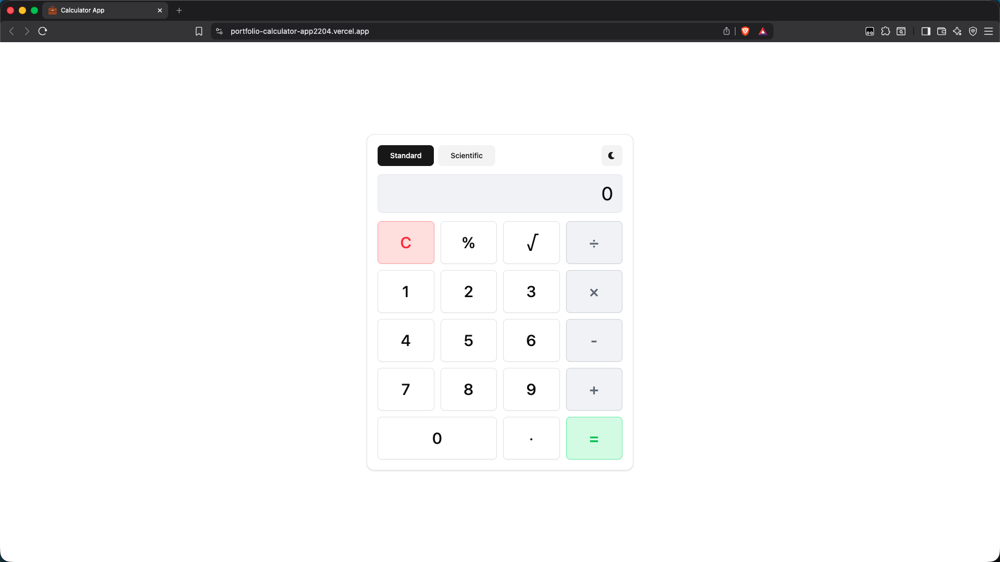
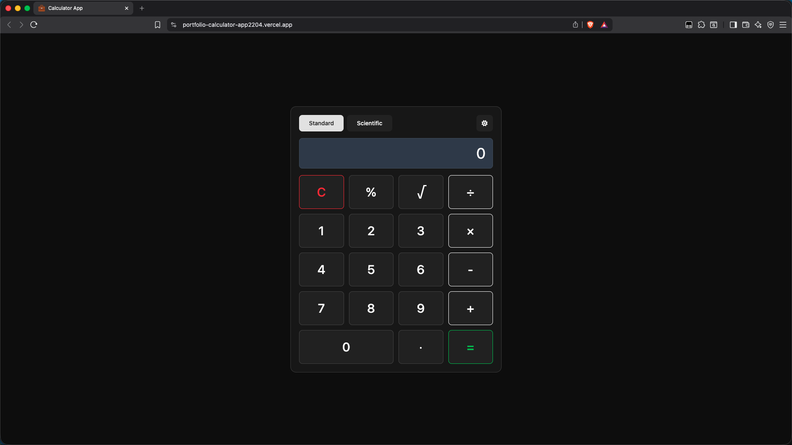
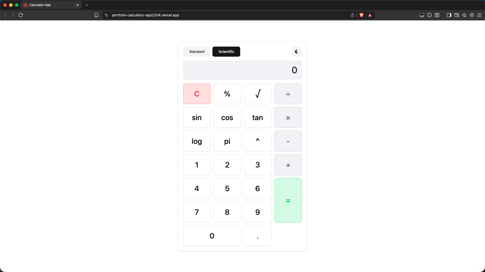
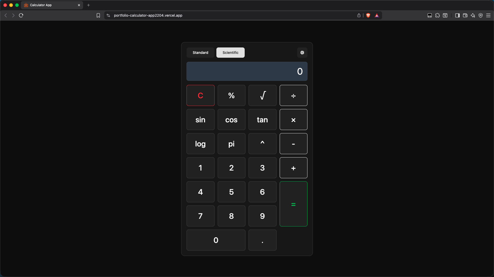

# __Calculator App__
A fully functional calculator application that offers both standard arithmetic and advanced scientific features. It supports trigonometric functions, logarithms, powers, constants, and additional scientific tools while keeping the interface clean and intuitive.
The project is structured with modular components and reusable hooks, focuses on maintainability, and delivers a smooth and responsive user experience across all screen sizes. The app also stores user preferences such as theme and calculator mode using local storage.

## __🚀 Live Preview__
[Click here to view the app online!](https://portfolio-calculator-app2204.vercel.app/)

## __📸 Screenshots__

### Standard Mode
<div style="display: flex; gap: 12px;">
  
  
</div>

### Scientific Mode
<div style="display: flex; gap: 12px;">
  
  
</div>

## __🧰 Tech Stack__
- Vite
- React
- TypeScript
- Tailwind CSS
- Shadcn/ui
- Font Awesome

## __💻 Local Installation__
```bash
git clone https://github.com/dominikw123/portfolio.calculator-app.git
cd calculator-app
npm install
npm run dev